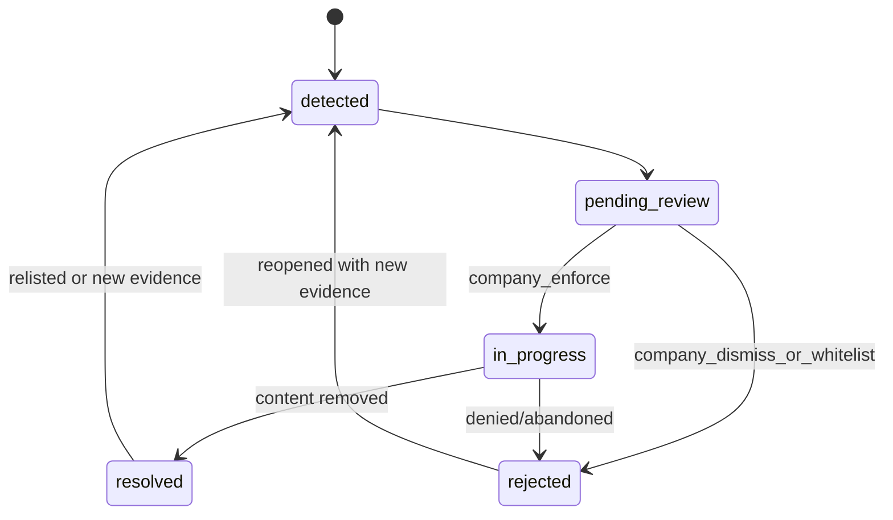

# Case Lifecycle and Status Reference

## Purpose

This document is the source of truth for case statuses, transitions, and owners in the V1 operating model:

1. AI detects.
2. Company reviews.
3. Lawyer + AI enforces.

## Canonical Infringement Statuses

These values are currently persisted in app/database status fields:

| Status | Meaning | Typical Owner |
| --- | --- | --- |
| `detected` | Newly created case from detection or manual intake | Detection/analysis agent |
| `pending_review` | Waiting for explicit company decision | Brand owner/company reviewer |
| `in_progress` | Enforcement started and not finished | Lawyer + enforcement AI |
| `resolved` | Closed with successful or accepted outcome | Enforcement/legal |
| `rejected` | Closed without success or dismissed during review | Brand owner/legal |

## Lifecycle Diagram

## Transition Rules

| From | To | Trigger | Actor |
| --- | --- | --- | --- |
| `detected` | `pending_review` | Initial classification complete | Agent |
| `pending_review` | `in_progress` | Company explicitly chooses enforce | Brand owner/company reviewer |
| `pending_review` | `rejected` | Company dismisses or whitelists | Brand owner/company reviewer |
| `in_progress` | `resolved` | Platform removes content or case closed positively | Lawyer + AI agent |
| `in_progress` | `rejected` | Platform denies, evidence insufficient, or legal stop | Lawyer + AI agent |
| `resolved` | `detected` | Monitoring finds relisting | Monitoring agent |
| `rejected` | `detected` | Reopen with stronger evidence | Brand owner/lawyer |

## Internal Enforcement Timeline (Case Updates)

For richer internal progress, use `case_updates.update_type` events:

1. `takedown_initiated`
2. `platform_contacted`
3. `dmca_sent`
4. `awaiting_response`
5. `follow_up_sent`
6. `escalated`
7. `content_removed`
8. `case_closed`
9. `custom`

These events provide detail without introducing conflicting top-level status enums.

## Enforcement Ownership Model

After company approval (`pending_review -> in_progress`):

1. AI agent prepares evidence pack and draft notices.
2. Lawyer reviews and edits draft/legal strategy.
3. Lawyer submits or authorizes submission.
4. AI agent tracks responses and follow-up deadlines.
5. Lawyer handles appeals, disputes, and legal escalation.

## Role Visibility

1. **Brand owner view:** primarily top-level case statuses and final outcomes.
2. **Admin/lawyer view:** full timeline events, escalation controls, and legal notes.
3. **Operations view:** aggregate flow metrics and stuck-case detection.

## Escalation Entry Points

Escalate from normal agent flow when any of the following is true:

1. Repeat offender risk exceeds policy threshold.
2. Platform rejects with legal ambiguity.
3. Appeal is filed by infringer.
4. High-value asset or regulated jurisdiction is involved.
5. Lawyer requests escalation due to legal risk.

See [AUTONOMY_AND_ESCALATION.md](./AUTONOMY_AND_ESCALATION.md) for full policy.

## Notification Triggers (Minimum)

| Event | Recipient |
| --- | --- |
| New case created | Brand owner |
| Case moved to `in_progress` | Brand owner |
| Case moved to `resolved` | Brand owner |
| Case moved to `rejected` | Brand owner + legal if escalated |
| Relisting detected (reopened) | Brand owner + legal |

## Related Docs

- [FLOW.md](./FLOW.md)
- [AGENT_OPERATING_MODEL.md](./AGENT_OPERATING_MODEL.md)
- [DATA_CONTRACTS.md](./DATA_CONTRACTS.md)
- [IMPLEMENTATION_PLAN.md](./IMPLEMENTATION_PLAN.md)
