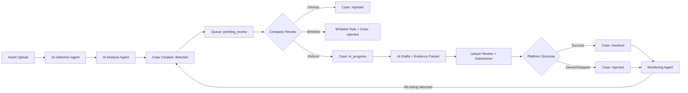

# Brandog System Flow (V1)

## Purpose

This document is the top-level system map for the current operating model:

1. AI agent handles detection.
2. Company reviews each case and decides whether to enforce.
3. If enforcement is approved, lawyer + AI agent execute enforcement together.

## Required Operating Model

1. **Detection is AI-driven.**
2. **Enforcement requires company review first.**
3. **Enforcement execution is lawyer + AI, not AI-only.**
4. **Monitoring and re-listing detection return to the same review gate.**

## End-to-End Process (1 to 6)

1. **Asset Intake**
   Brand owner uploads images/videos/text/IP materials.
2. **AI Detection**
   Detection and analysis agents scan, score, and assemble evidence.
3. **Case Creation**
   New cases are created as `detected`, then moved to `pending_review`.
4. **Company Review Gate**
   Brand owner chooses: `Enforce`, `Dismiss`, or `Whitelist`.
5. **Lawyer + AI Enforcement**
   If `Enforce` is chosen, case moves to `in_progress`; AI prepares drafts and evidence, lawyer validates/submits.
6. **Outcome + Monitoring**
   Case becomes `resolved` or `rejected`; monitoring agent reopens on re-listing.

## Flow Diagram

## Canonical Status Model

| Status | Meaning | Primary Owner |
| --- | --- | --- |
| `detected` | New potential infringement from AI or manual input | AI agent |
| `pending_review` | Waiting for explicit company decision | Company |
| `in_progress` | Enforcement approved and underway | Lawyer + AI agent |
| `resolved` | Successful closure | Lawyer + AI agent |
| `rejected` | Dismissed or unsuccessful closure | Company or lawyer |

## Enforcement Gate Rule

`pending_review -> in_progress` must only happen after explicit company enforce action in V1.

## Visibility Model

1. Brand owner sees detections, review queue, and case outcomes.
2. Lawyer/admin sees full enforcement timeline and legal actions.
3. Operations sees scan health, queue health, and budget telemetry.

## Related Docs

- [ASSETS.md](./ASSETS.md)
- [CASE_LIFECYCLE.md](./CASE_LIFECYCLE.md)
- [AGENT_OPERATING_MODEL.md](./AGENT_OPERATING_MODEL.md)
- [AUTONOMY_AND_ESCALATION.md](./AUTONOMY_AND_ESCALATION.md)
- [IMPLEMENTATION_PLAN.md](./IMPLEMENTATION_PLAN.md)
- [DATA_CONTRACTS.md](./DATA_CONTRACTS.md)
